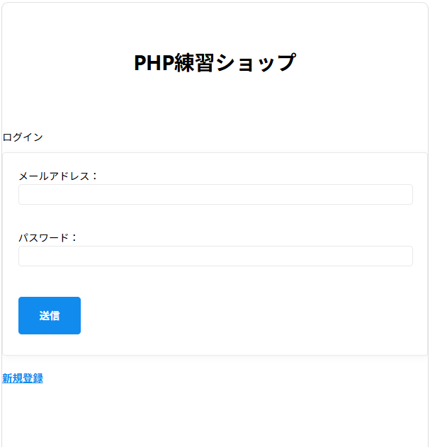
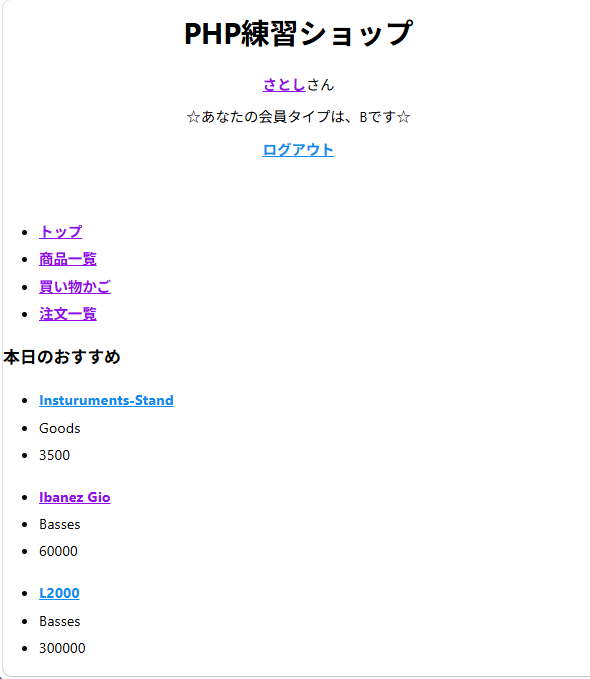
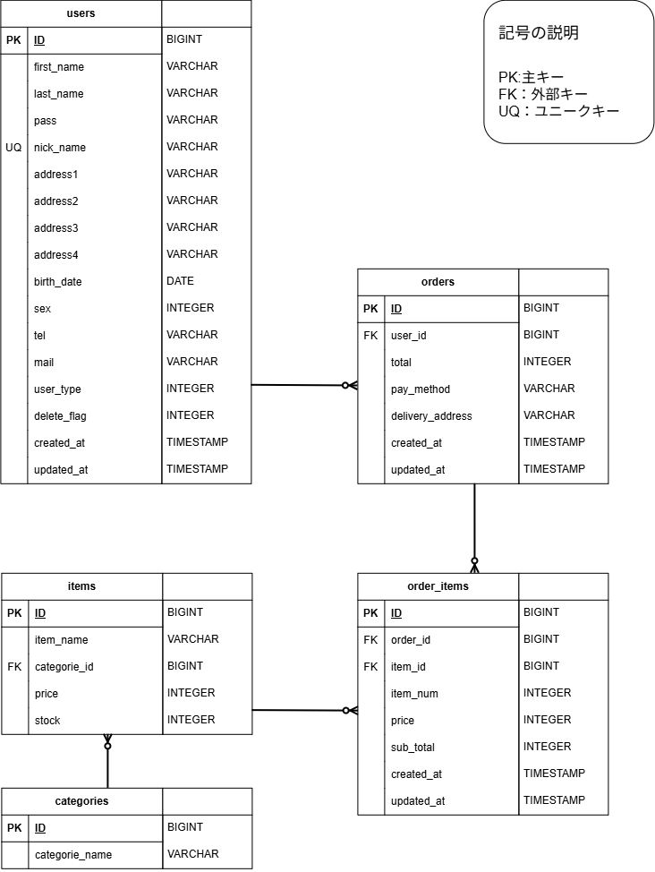
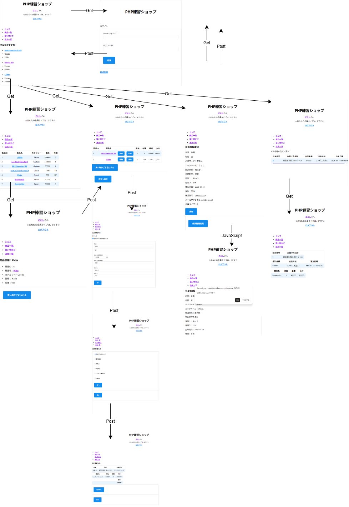

  

## URL

https://laravelpracticewithdocker.onrender.com/showTop  
### TestUser  
'mail@testmail'  
'1111'  
サイト起動時に30~50秒程度時間がかかる可能性があります。ご理解をお願いいたします。

## About Project

本プロジェクトは、PHPおよびLaravelの学習を目的として作成したプロジェクトです。大部分の機能完成後、DockerおよびGitとの連携を追加の課題として実施し、保守性・可読性を意識した形への整備を施しています（ex:Fat Controllerの解決・Service化、クラスレスCSSの導入）。  
現在、Serviceの追加実装、Controllerとの分掌を完了しました。  
Renderへのデプロイに伴い、DBをMySQLからPostgreSQLに変更しました。

作成開始時期は2026年7月3日頃です。  

## ScreenShots

  

##  Contents

ECサイトとして作成しており、主要機能は
- ログイン
- ログアウト
- 商品一覧、詳細
- 買い物かご
- 注文登録
- 注文履歴
- 会員登録（メール認証）
- ユーザ情報の変更
- 退会（論理削除）
です。  

## Documents

  

##  Tools

- PHP 8.2
- Laravel 12
- PostgreSQL
- Apache
- Render
- Docker
- Git
- Mailtrap  
＊デプロイに伴いMySQL→PostgreSQLに変更しました。  
フロントではHTML5、CSS3、クラスレスCSSのMVPを使用しています。

DockerとGitを用いた初期環境整備が可能です。  
デプロイにはRenderを使用しています。

##  Caution

Docker環境に移行した際に開発環境をWSLのUbuntuに移行しています。動作確認はLinuxとなっております。Linux上での実行を推奨いたします。

ページ内メール認証機能のメール送信にはMailtrapを使用しています。公開環境ではSMTP設定の都合上、実際のメール送信は無効化しています。実際のメールアドレスを入力されないようお願いいたします。